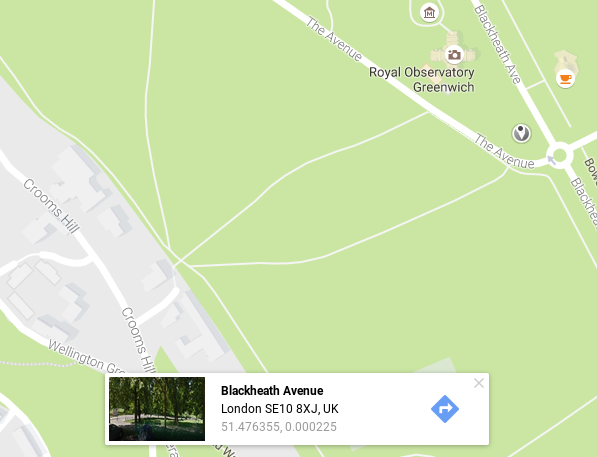

## Longitude and latitude

It would be nice if you could pick a Weather Station that's close to you to fetch the data from. You can do this, because the database stores the longitude and latitude of all the Weather Stations around the world. Let's have a look at what we mean by longitude and latitude.

- If you wanted to pinpoint a place on a 2D object like a piece of paper, you could use x and y coordinates. The x coordinate would place the point's horizontal position, and the y coordinate would place the vertical position. You can see an example of this below.

    

- Things aren't so simple when you're trying to pinpoint a location on a sphere, like the Earth. The vertical and horizontal positions wrap around the sphere, for a start. Also, travelling 5 units of distance along the equator would be a completely different distance to walking 5 units of distance near one of the poles. For this reason we use longitude and latitude when locating items on the Earth's surface.

- You can draw two imaginary circles around the Earth. The first is called the equator, which you're probably familiar with. The second is called the prime meridian, which passes through both the North and South Poles and also through Greenwich in London.

    

- The centre of these two circles is at the centre of the Earth. Imagine you were standing in the centre of the Earth; you would be able to pinpoint any location on the surface by talking about how many degrees you needed to turn within each of these circles. Longitude tells you how many degrees you need to turn east or west from the prime meridian. Latitude tells you how many degrees you need to turn north or south from the equator.

    
    
- The easiest way to find your longitude and latitude is to use [Google Maps](https://www.google.co.uk/maps/). You can click on any spot on the map, and your longitude and latitude will be revealed at the bottom of the screen.

    
    
- The first number is your latitude and the second is your longitude. Make a note of the values you get, as you'll need them later.

