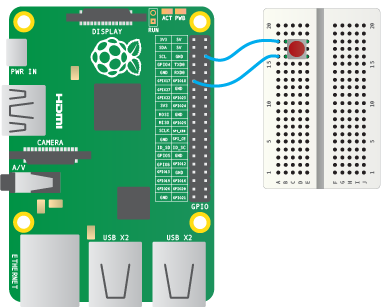

# Fetching the Weather

One thousand weather stations were sent out to schools all over the world, at the beginning of 2016, ready to be assembled and begin collecting weather data.

Each weather station comes equipped with the sensors, shown in the table below

|Sensor Name|Purpose|
|-----------|-------|
|Rain Gauge|Measures the volume of rain falling in milimetres per square|
|Annenomter|Measures the wind speed in kilometres per hour|
|Wind Vane|Measures the wind direction in degrees|
|Soil Temperature probe|Measures the soild temperature in degrees celcius|
|Temperature sensor|Measures the air temperature in degrees celcius|
|Humidity Sensor|Measures the humidity of the air as a percentage|
|Pressure Sensor|Measures the atmospheric pressure in Pascals
|Air Quality Sensor|Measures the air quality in arbitary units|


## The First Step

First we'll do X.

1. First do A

1. Then do B

1. Now do C in code:

    ```python
    print("Hello world")
    ```

    In Python the `print` function is something

1. Now do D:

    

    Wire up the button to pin 17 and ground

1. Now do X

Now we have X

## The Next Step

Now we've done X, we'll do Y.

1. First do A

1. Then do B

1. Now do C in code:

    ```python
    print("Hello world")
    ```

    In Python the `print` function is something

1. Now do D

1. Now do Y

Now we have X and Y
