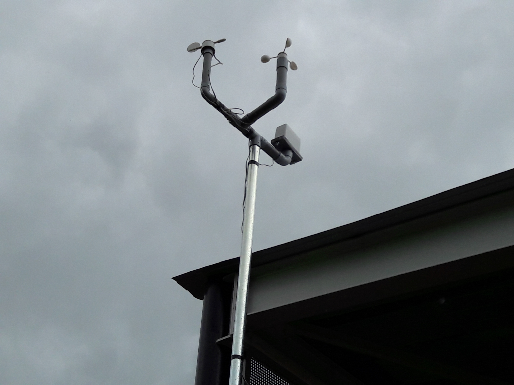

# Fetching the Weather

One thousand Weather Stations were sent out to schools all over the world at the beginning of 2016, ready to be assembled and begin collecting global weather data.



Each Weather Station comes equipped with the sensors shown in the table below:

|Sensor Name|Purpose|
|-----------|-------|
|Rain gauge|Measures the volume of rain falling in millimetres|
|Anemometer|Measures the wind speed in kilometres per hour|
|Weathervane|Measures the wind direction in degrees|
|Soil temperature probe|Measures the soil temperature in degrees Celsius|
|Temperature sensor|Measures the air temperature in degrees Celsius|
|Humidity sensor|Measures the relative humidity of the air as a percentage|
|Pressure sensor|Measures the atmospheric pressure in Pascals|
|Air quality sensor|Measures the air quality as a relative percentage|

The Weather Stations continually monitor the weather and then send their data to an Oracle database, where it is stored and can be accessed.

In this resource you're going to learn how to find a Weather Station you're interested in, and then get the latest weather updates from that station.

## Finding a Weather Station

You can get a list of all the Weather Stations that are currently online, using a simple URL. This is because the database that all the Weather Stations upload data to has a RESTful API. This is a method by which you can write code that uses simple HTTP requests (just like a browser) to fetch the data.

Copy and paste the following URL into a web browser:

    ``` html
    https://apex.oracle.com/pls/apex/raspberrypi/weatherstation/getallstations
    ```

You should see a web page filled with data. This is a little difficult to read, though. Luckily, we can grab this data with a little Python code and then present it in a format that's easier to read.

1. Click on `Menu` > `Programming` > `Python3 (IDLE)` to open a new Python shell, then click on `File` > `New File`.

1. The first thing you'll need is a few Python modules. One of them is not in the standard library, but you can install it from the [Software Requirements page](https://raspberrypi.org/learning/fetching-the-weather/requirements/software/).

    ``` python
    from requests import get
    import json
    from pprint import pprint
    ```

1. The `requests` module allows you to fetch web pages from the World Wide Web. The `json` module allows you to easily read JSON data (which is a way of organising data into dictionaries). The `pprint` module is short for pretty-print, and just makes presenting text a little clearer.

1. The next thing to do is to save that URL you used earlier as a variable:

    ``` python
    url = 'https://apex.oracle.com/pls/apex/raspberrypi/weatherstation/getallstations'
    ```

1. Using `get` from the `requests` module you can now fetch the data, and translate it into Python dictionaries using the `json` module:

    ``` python
    stations = get(url).json()['items']
    ```

1. Save and run your code. You can type `stations` into the Python shell to have a look at the data.

1. It still looks pretty ugly. Try typing `pprint(stations)` and see what happens. You should see a huge list of Weather Stations dictionaries. Each dictionary should look something like this:

    ``` json
     {'weather_stn_id': 1648902,
      'weather_stn_lat': 52.197834,
      'weather_stn_long': 0.125366,
      'weather_stn_name': 'ACRG_ROOF'}]
    ```

1. What you're seeing is the unique ID of the station, its location in the world using `longitude` and `latitude` (You can learn about this in [worksheet2](worksheet2.md)), and the name of the Weather Station.

1. For the next part, you're going to need to pick a Weather Station to fetch the weather from. Scroll up and down the list and pick a `weather_stn_id` that you'd like to have a look at.

## Fetching the latest weather

Now that you have a Weather Station to look at, you can learn how to fetch the last weather recording from that station.
This is again handled using the RESTful API of the Weather Station database. This time, the URL you need is made up of two parts. The first tells the database that you're requesting the latest measurements:

    ``` html
'https://apex.oracle.com/pls/apex/raspberrypi/weatherstation/getlatestmeasurements/'
    ```
You need to add the ID of the Weather Station you wish to access to the end of this. For example:

    ``` html
    'https://apex.oracle.com/pls/apex/raspberrypi/weatherstation/getlatestmeasurements/1648902
    ```

1. Create a new Python file again, by clicking on `File` > `New File`.
1. Once again, you'll need the `requests` and `json` modules, as well as `pprint`:

    ``` python
    from requests import get
    import json
    from pprint import pprint
    ```

1. Now you can define a new `url` variable, but using the Weather Station ID you've chosen:

    ``` python
    url = 'https://apex.oracle.com/pls/apex/raspberrypi/weatherstation/getlatestmeasurements/weather_stn_id_goes_here
    ```

1. To get the latest measurements you need one line of code, but we'll add a second line to pretty-print it straight away:

``` python
weather = get(url).json()['items']
pprint(weather)
```

1. You should see something like the following appearing in the shell:

    ``` json
    >>> [{'air_pressure': 1008.81,
      'air_quality': 74.9,
      'ambient_temp': 23.58,
      'created_by': 'ACRG_ROOF',
      'created_on': '2016-11-16T12:00:01Z',
      'ground_temp': 18.69,
      'humidity': 33.41,
      'id': 1669238,
      'rainfall': 0,
      'reading_timestamp': '2016-11-16T12:00:01Z',
      'updated_by': 'ACRG_ROOF',
      'updated_on': '2016-11-16T12:05:02.437Z',
      'weather_stn_id': 1648902,
      'wind_direction': 315,
      'wind_gust_speed': 0,
      'wind_speed': 0}]
    ```

1. If you don't see any data, it might be because the Weather Station is offline. Just try another Weather Station Id.

## What next?

- In [worksheet two](worksheet2.md) you'll learn all about longitude and latitude, and how to get the weather data for the closest Weather Station to your current location.
