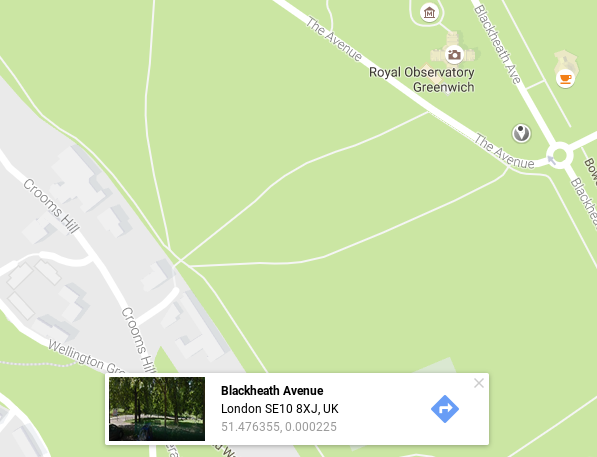

# Finding a Station near you

## Longitude and Latitude

It would be nice if you could pick a weather station that is close to you, to fetch the data from. You can do this because the database stores the longitude and latitude of all the weather stations around the world. Let's have a look at what we mean by longitude and latitude.

1. If you wanted to pin point a place on a 2D object like a piece of paper, you could use x and y coordinates. The x coordinate would place the points horizontal position, and the y coordinate would place the vertical position. You can see an example of this below.

    

1. Things aren't so simple when you're trying to pinpoint a location on a sphere, like the Earth. The vertical and horizontal positions wrap around the sphere, for a start. Also, travelling 5 units of distance along the equator would be a completely different distance to walking 5 units of distance near one of the poles. For this reason we use longitude and latitude when locating items on the Earth's surface.

1. You can draw two imaginary circles around the Earth. The first is called the Equator, which you are probably familiar with. The second is called the Prime Meridian, which passes through both the North and South poles and also through Greenwich in London.

    

1. The centre of these two circles is at the centre of the Earth. Imagine you were standing in the centre of the Earth, you would be able to pinpoint any location on the surface by talking about how many degrees you needed to turn within each of these circles. Longitude tells you how many degrees you need to turn East or West from the Prime meridian. Latitude tells you how many degrees you need to turn North or South from the equator.

    
    
1. The easiest way to find your longitude and latitude is to use [Google Maps](https://www.google.co.uk/maps/). You can click on any spot on the map, and your longitude and latitude will be revealed at the bottom of the screen.

    
    
1. The first number is your latitude and the second in your longitude. Make a note of the values you get, as you'll need them later.

## Finding the distance between two points on the Earth

The next part is a little technical. You need to be able to find the distance between two points on the Earth, given their longitudes and latitudes. This will allow you to find the closest weather station to you.

If you're not particularly interested in how this works then rather than write the code, you can download the file you need from [here](https://raw.githubusercontent.com/raspberrypilearning/fetching-the-weather/master/code/haversine.py). Just make sure it is saved as `haversine.py` and stored in the same directory as the rest of your code.

As discussed earlier, we use longitude and latitude to work out the exact position of places on the Earth. Finding distances between these points is quite tricky, as the distance is over the surface of a sphere, and therefore not in a straight line. To do this calculation, you need a clever bit of maths called the [haversine formula](https://en.wikipedia.org/wiki/Haversine_formula).

Without getting too technical, the haversine formula can provide the distance between two points on a sphere using longitudes and latitudes.

1. Open up a Python shell by clicking on `Menu` > `Programming` > `Python3 (IDLE)`.
1. Now click on `File` > `New File` to create a new python script. Click on `File` > `Save As` and call your file `haversine.py`.
1. To begin with you're going to need a few functions from the `maths` library. Start off you file by importing the following:

    ``` python
    from math import radians, cos, sin, asin, sqrt
    ```

1. Now you can define a new function, which we'll call `haversine`. It's going to take 4 arguments, which will be the longitude and latitude of the two points whose distance we need to find.

    ``` python
    def haversine(lon1, lat1, lon2, lat2):
    ```
1. Most mathematical formula require us to work in [radians](http://www.bbc.co.uk/bitesize/higher/maths/trigonometry/radian_and_equations/revision/1/) rather than degrees when working with angles, so the first thing to do is to convert each of the latitudes and longitudes passed into the function as arguments, into radians.

    ``` python
    def haversine(lon1, lat1, lon2, lat2):
        #convert degrees to radians
        lon1 = radians(lon1)
        lat1 = radians(lat1)
        lon2 = radians(lon2)
        lat2 = radians(lat2)
    ```
    
1. Now we want to find the difference between the two longitudes and latitudes, so add this into your function:

    ``` python
        dlon = lon2 - lon1 
        dlat = lat2 - lat1 
    ```

1. Now comes the tricky bit. If you want to know more about the haversine formula then you can have a read of the Wikipedia article linked above. Otherwise you can just take it at face value that the following lines of code, will calculate the distance between the two points

    ``` python
        a = sin(dlat/2)**2 + cos(lat1) * cos(lat2) * sin(dlon/2)**2
        distance = 2 * asin(sqrt(a)) * 6371 #6371 is the radius of the Earth
        return distance
    ```

1. Save your file once again, and then you can test it. Run your file, and then in the shell you can type the following:

    ``` python
    haversine(74,0059, 40.7128, 0.1278, 51.5074)
    ```

1. You should get an answer of 5570. This is the distance from London to New York. You can check the answer online if you like, although the values will be slightly different as the Earth is not an exact sphere. It's good enough for our purposes though.

Try a few more longitudes and latitudes from Google Maps.

## Getting ready
In worksheet one you fetched all the weather stations that are currently registered. The data came in as huge list of dictionaries. By iterating through this list, you can pick out the longitude and latitude of the weather stations, and then run it through your haversine function to find the closest one.

1. Create a new Python file (`File` > `New File`) and make sure you save it in the same directory as your `haversine.py` file.

1. Start by importing the `requests`, `json` and `pprint`modules that you used in worksheet one, but you can now also import your haversine function.

    ``` python
    from requests import get
    import json
    from pprint import pprint
    from haversine import haversine
    ```

1. In worksheet one, you used two URLs to get the weather stations and the latest weather. You can declare these variables straight away.

    ``` python
    stations = 'https://apex.oracle.com/pls/apex/raspberrypi/weatherstation/getallstations'
    weather = 'https://apex.oracle.com/pls/apex/raspberrypi/weatherstation/getlatestmeasurements/'
    ```

1. The second URL isn't complete, as you need to add the weather station id to the end. You're going to do that in code.

1. Now add in variables for your current longitude and latitude, that you found using Google Maps.

    ``` python
    my_lat = 52.194504
    my_lon = 0.134708
    ```

1. To finish off this section, you can fetch the list of all stations, just like you did in worksheet one.

``` python
all_stations = get(stations).json()['items']
```

## Finding the closest station

For this to work, you're going to need to run the longitude and latitude of all the stations through the haversine function. The trick will be finding the smallest distance to your current longitude and latitude, and saving this as a variable.

1. Start by defining a new function, and within it, setting a variable for the smallest distance. The longest possible distance between two points on the Earth's surface is 20036km, so this would be a good place to start the variable.

    ``` python
    def find_closest():
        smallest = 20036
    ```

1. Now you can use a `for` loop to iterate through all the stations. Let's start just by printing the data for each.

    ``` python
        for station in all_stations:
            print(station)
    ```

1. To get the list of stations you need to run your function, so type the following into the *shell*.

    ``` python
    find_closest()
    ```

1. You should see a large list of dictionaries. With each dictionary looking something like this:

    ``` python
    {'weather_stn_name': 'ACRG_ROOF', 'weather_stn_lat': 52.197834, 'weather_stn_id': 1648902, 'weather_stn_long': 0.125366}
    ```

1. The data we're interested in is the `'weather_stn_lat'` and `'weather_stn_long'`. These are the values we want to use in the haversine function.

1. Go back to your script and you can now get those values in your function. Remove the `print` and then add the following.

    ``` python
            station_lon = station['weather_stn_long']
            station_lat = station['weather_stn_lat']
    ```

1. Now that you have all the data, it can be run through the haversine function to find the station's distance to you

    ``` python
            distance = haversine(my_lon, my_lat, station_lon, station_lat)
            print(distance)
    ```

1. Run the code again and type `find_closest()` in the shell again.

1. That's a *long* list of distances. Next you need to find the smallest one and then save that stations id. If the distance is smaller that the `smallest` variable it can be saved, and then next time around the lope it can be checked again.

    ``` python
            if distance < smallest:
                smallest = distance
                closest_station = station['weather_stn_id']
        return closest_station
    ```

## Getting the weather data

Now that you can get the closest weather station to you, getting the data is just as easy as it was in worksheet one.

1. Start by calling your newly created function and saving the weather station id.

    ``` python
    closest_stn = find_closest()
    ```

1. Now this can be added to the end of the `weather` variable that stores the URL. It's an integer at the moment through, so it needs to be changed to a string.

    ``` python
    weather = weather + str(closest_stn)
    ```

1. Finally, you can use `requests` to get the data and then pretty print it.

    ``` python
    my_weather = get(weather).json()['items']
    pprint(my_weather)
    ```

1. Run your code and you should see the weather data for the station nearest you, printed out in the shell.

## What Next?
- You could have a look at some weather data from other locations in the world. Use the web to find some longitude and latitudes of other places, and then fetch weather from their nearest stations.

- How about importing the data from several weather stations into some spreadsheet software and drawing some graphs. Or maybe you'd like to try and use Python to draw some graphs for you.
